# Documento de escopo do Piloto (PRD)

## Objetivos e KPIs

### Contexto e diagnóstico do cenário atual

A Sincroniza Educação não contava com um sistema centralizado de banco de dados. O armazenamento das informações dos projetos era realizado de forma descentralizada via Google Sheets, cuja padronização entre projetos só começou a ser implementada em 2025. Essa estrutura em planilhas alimentava o Gestão à Vista, um dashboard desenvolvido em Looker Studio responsável por centralizar indicadores de alcance, formações, satisfação dos clientes e informações institucionais.

Atualmente, essa solução legada apresenta limitações severas que comprometem a tomada de decisão estratégica:

* **Baixa performance e instabilidade:** páginas quebradas, falhas constantes de integração entre as fontes de dados e tempo de carregamento (*load time*) extremamente elevado.
* **Defasagem das informações:** dados desatualizados nos painéis, exigindo esforço manual recorrente para atualização das planilhas-mãe.
* **Alta carga operacional e erro humano:** a equipe de projetos consome tempo relevante com o preenchimento redundante de dados em múltiplas abas (Redes, Municípios, Escolas), estando sujeita a falhas de digitação e inconsistências nominais.
* **Risco de segurança e LGPD:** armazenamento de dados pessoais sensíveis (como nome, CPF, e-mail e telefone de participantes) diretamente em planilhas, sem controles avançados de acesso, logs de auditoria ou criptografia.
* **Falta de integridade e rastreabilidade:** inexistência de travas de validação (*data validation*) na entrada dos dados, ausência de histórico de edições e alto risco de perda de fórmulas ou exclusão acidental de registros.
* **Gargalo de escalabilidade:** o uso do Google Sheets como "banco de dados" impede o crescimento da operação e a automação de consultas complexas.

### Objetivo da nova solução

Diante das discussões sobre inovação, stack tecnológica e governança de dados na Sincroniza, a equipe de Inteligência identificou a necessidade de ir além da mera recriação do painel visual.

O projeto consiste no desenvolvimento de um Sistema Operacional de Gestão, atuando como o piloto da nova stack da organização. A solução assumirá a coleta, a validação e o armazenamento estruturado dos dados de projetos na ponta (eliminando as planilhas), ao mesmo tempo em que alimentará nativamente a nova versão do Gestão à Vista integrado, com dados em tempo real, alta performance e inteligência geográfica baseada no Censo Escolar/INEP.

### Métricas de sucesso do Piloto (KPIs)

| Categoria | Objetivo específico | KPI |
| :--- | :--- | :--- |
| **Integridade de dados** | Eliminar inconsistências manuais, duplicidades e divergências entre abas através de dados encadeados e relacionais. | **0% de erros de digitação manual** (dados 100% padronizados via selects, formulários parametrizados e base INEP). |
| **Eficiência operacional** | Reduzir o tempo gasto pela equipe na coleta e cadastro de escopo dos projetos. | **Redução de 70% no tempo de preenchimento** por projeto em comparação com o Google Sheets. |
| **Performance técnica** | Solucionar a lentidão do Looker Studio e garantir carregamento rápido dos painéis. | **Tempo de carregamento (load time) < 2s** em todas as visualizações do sistema. |
| **Segurança & LGPD** | Garantir armazenamento seguro de dados sensíveis e credenciais de ferramentas. | **100% de conformidade**: zero senhas/CPFs em texto puro e acesso restrito por perfil (RBAC). |
| **Adoção & UX** | Garantir adesão total do time de projetos e percepção de facilidade na nova interface. | **100% de adoção** pelos gestores do piloto e **NPS interno > 80** sobre a facilidade da ferramenta. |
| **Disponibilidade** | Eliminar o problema de "páginas quebradas" da versão legada. | **Uptime de 99,5%** e zero falhas de integração no pipeline de dados. |

## Público-alvo

O sistema foi pensado como um **Sistema Operacional único para todas as colaboradoras da Sincroniza Educação**. Todas as páginas, dados e recursos da plataforma são acessíveis a toda a equipe interna, promovendo transparência e integração entre as áreas. 

Na visão geral de projetos, coordenadoras, gerentes, analistas e assistentes têm acesso direto aos **seus projetos atribuídos** e às páginas comuns da organização, enquanto a Direção, Lideranças e equipes internas de apoio (como Intel e Conteúdo) possuem acesso visual e/ou de edição a **todos os projetos**.

A inteligência de perfil (RBAC) atua na **Página Inicial (`03-inicio`)**, adaptando a tela principal para exibir a curadoria de blocos, alertas e tabelas mais relevantes para a rotina de cada grupo:

* **Direção e Lideranças:** exibe a *Saúde dos Projetos* com alternância rápida entre abas de visão geral de *Dados*, *Entregas*, *Riscos* e *Metas*.
* **Coordenadoras e Gerentes:** foco no acompanhamento tático, apresentando *Saúde dos Projetos*, a tabela de *Próximas Formações* e o bloco de *Lembretes*.
* **Analistas e Assistentes:** foco na execução diária, trazendo o painel de *Avisos* (desatualização dos dados) e a tabela de *Próximas Formações*.
* **Conteúdo:** foco na esteira de produção, destacando a tabela de *Próximas Formações* e a gestão de *Materiais de Engajamento*.
* **Intel:** foco em governança de dados, exibindo o painel de *Saúde dos Projetos* voltado para métricas de completude dos dados.

> **Regra de exceção / Atuação híbrida:** caso um colaborador pertença a um grupo (ex: Analista), mas atue em outra função dentro de um projeto específico (ex: como Gerente), a sua página **Início** ganha automaticamente a aba/visão referente a esse outro grupo, garantindo que ele tenha acesso imediato às ferramentas necessárias sem perder sua visão padrão.

## Páginas e visuais abrangidos

O escopo do Piloto contempla a entrega funcional e visual de **19 páginas/formulários**:

### 1. Autenticação e estrutura base

* `01-login`: Tela de autenticação com login corporativo `@sinc.com.br`.

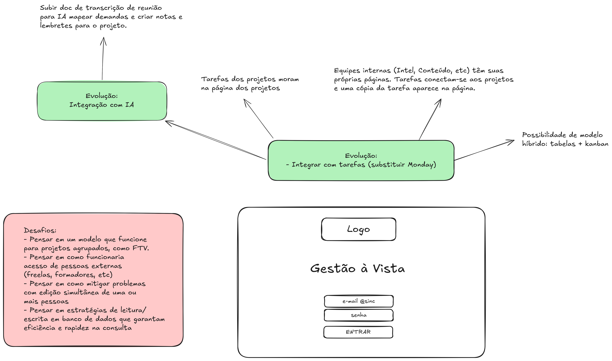

* `02-esqueleto`: Layout base com navegação lateral retrátil e controle de perfil de acesso.

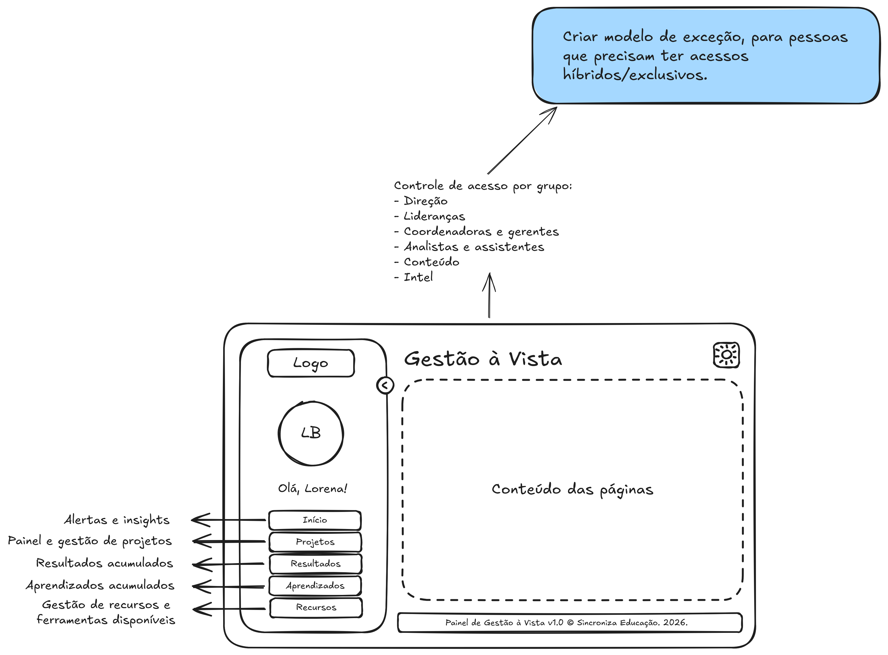

* `03-inicio`: Dashboard inicial adaptado dinamicamente para cada grupo de usuário.

### 2. Gestão de projetos

* `04-projetos`: Tabela centralizadora de projetos com busca, filtros de cabeçalho e ordenação.

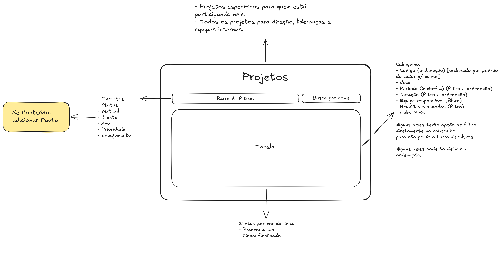

* `05-projeto-instancia`: Hub centralizador do projeto (*Single Source of Truth*), unindo Escopo, Gestão e Resultados.

#### 2.1. Escopo

* `06-escopo-publico`: Modal de definição do público-alvo e vínculo institucional padrão.

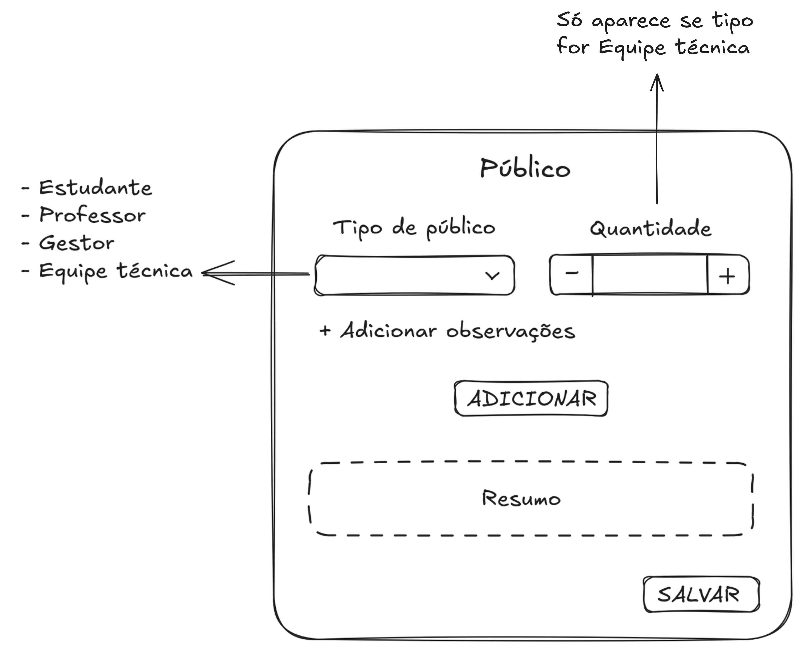

* `07-escopo-encontros`: Formulário parametrizado de eventos, logística e participação.

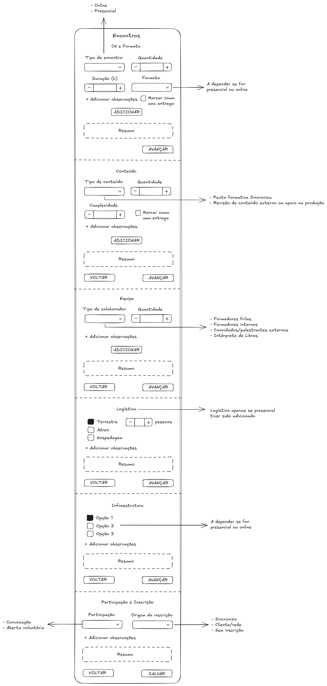

* `08-escopo-solucoes-educacionais`: Mapeamento de formatos, plataformas e suporte.

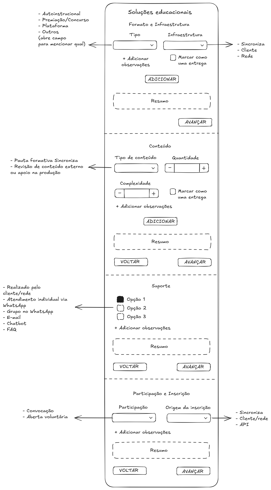

* `09-escopo-instrumentos`: Especificação de formulários, sistemas e relatórios solicitados.

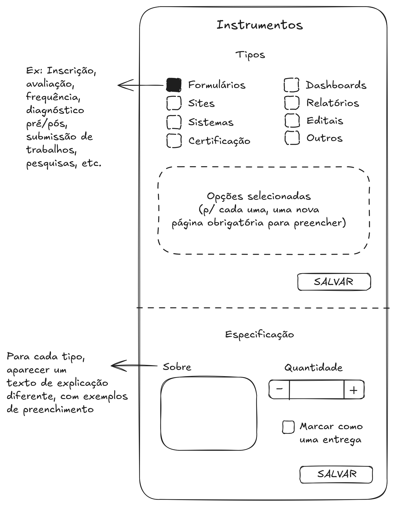

* `10-escopo-engajamento`: Definição do nível de contratação e materiais de comunicação.

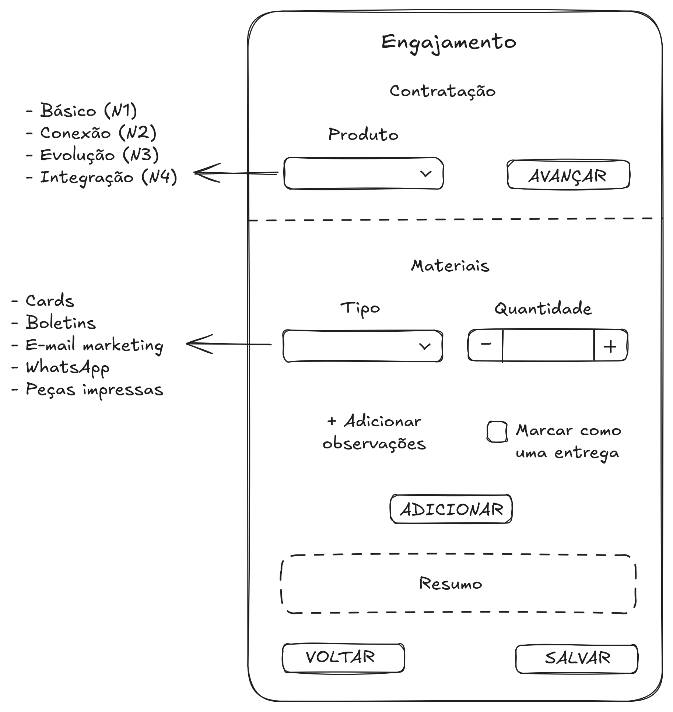

#### 2.2. Execução e operação

* `11-gestao-entregas`: Visualização de cronograma (Gantt/Calendário) e checklist de entregas com efeito cascata para cancelamentos.

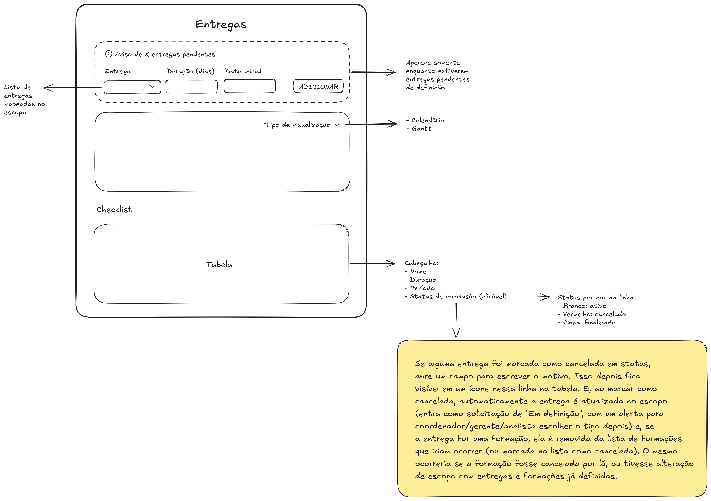

* `12-gestao-riscos`: Mapeamento de riscos com Matriz GUT e planos de mitigação.

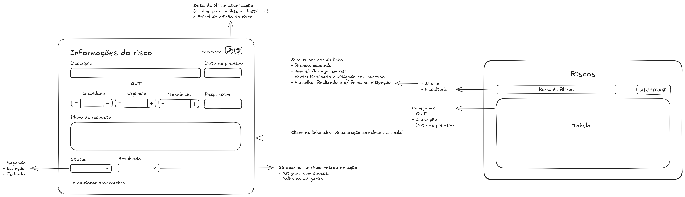

* `13-gestao-metas`: Acompanhamento de metas internas, compartilhadas e de clientes.

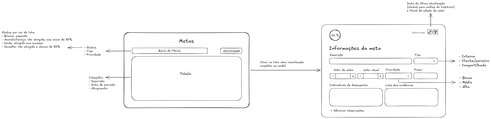

* `14-gestao-formacoes`: Controle de pautas formativas, formulários e listas de presença.

* `15-gestao-alcance`: Coleta de alcance por território/escola (via INEP) ou upload nominal (CSV) com suporte a amostras.

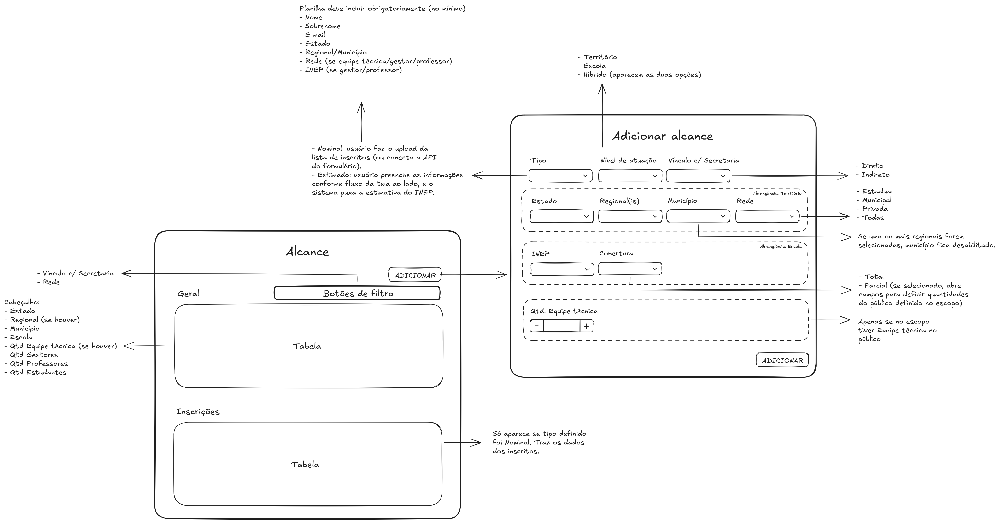

* `16-gestao-aprendizados`: Registro de *post-mortem* por etapa do projeto.

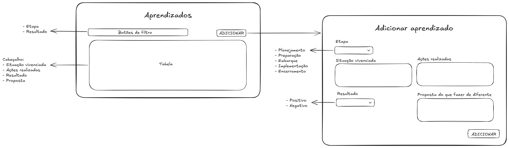

### 3. Visões consolidadas

* `17-resultados`: Dashboard executivo global com mapa de densidade, métricas acumuladas e histórico temporal.

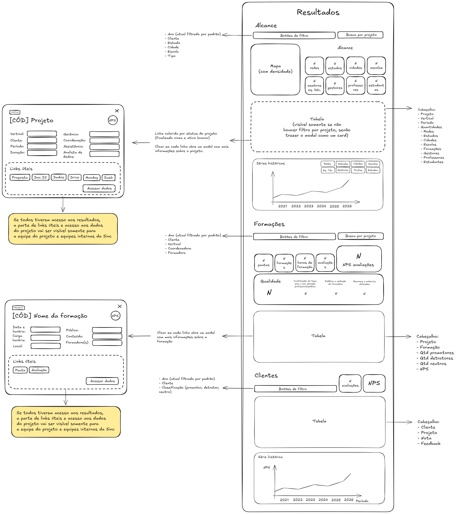

* `18-aprendizados`: Painel acumulado de lições aprendidas para gestão do conhecimento organizacional.

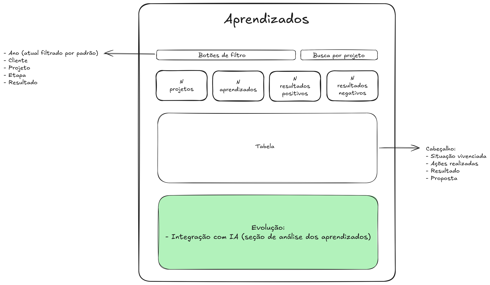

### 4. Recursos

* `19-recursos`: Central de instrumentos compartilhados e cofre de credenciais de ferramentas por área.

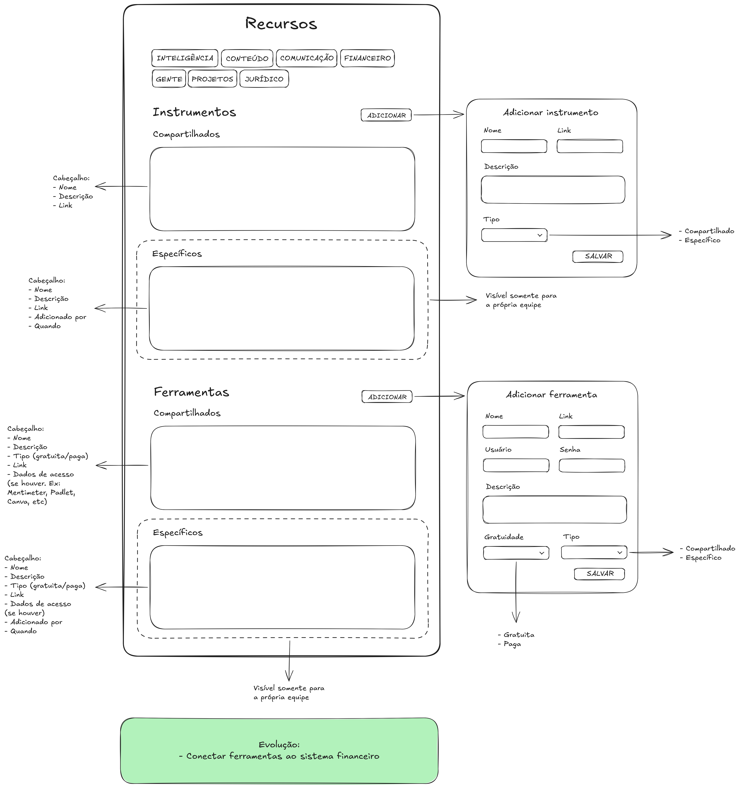

## Cronograma e prazos

| Fase | Escopo Técnico e atividades | Prazo | Responsável |
| :--- | :--- | :--- | :--- |
| **Fase 1: Design System & Setup** | Finalização dos componentes do DS em React/Storybook e setup da arquitetura do sistema Gestão à Vista, dentro do monorepo. | **Semanas 1 a 3** | Lorena Bastos |
| **Fase 2: Banco de Dados & APIs** | Modelagem do Schema (PostgreSQL/Prisma), autenticação/RBAC, integração com a API do INEP, rotas de CRUD e parser de upload de CSV. | **Semanas 4 a 6** | Lorena Bastos |
| **Fase 3: Front-end & Regras de negócio** | Montagem das 19 telas consumindo os componentes do DS e as APIs. Implementação das lógicas relacionais. | **Semanas 7 a 11** | Lorena Bastos |
| **Fase 4: TDD, QA & Segurança** | Escrita de testes de integração e e2e (Cypress/Playwright), auditoria de segurança (criptografia de senhas/LGPD) e homologação interna de produto. | **Semanas 12 a 13** | Lorena Bastos |
| **Fase 5: Infraestrutura & Deploy** | Provisionamento de servidores, pipeline de CI/CD em produção, configuração de variáveis de ambiente do monorepo, migração do banco e Go-Live. | **Semana 14** | Lorena Bastos e Fernando Nicolay |
